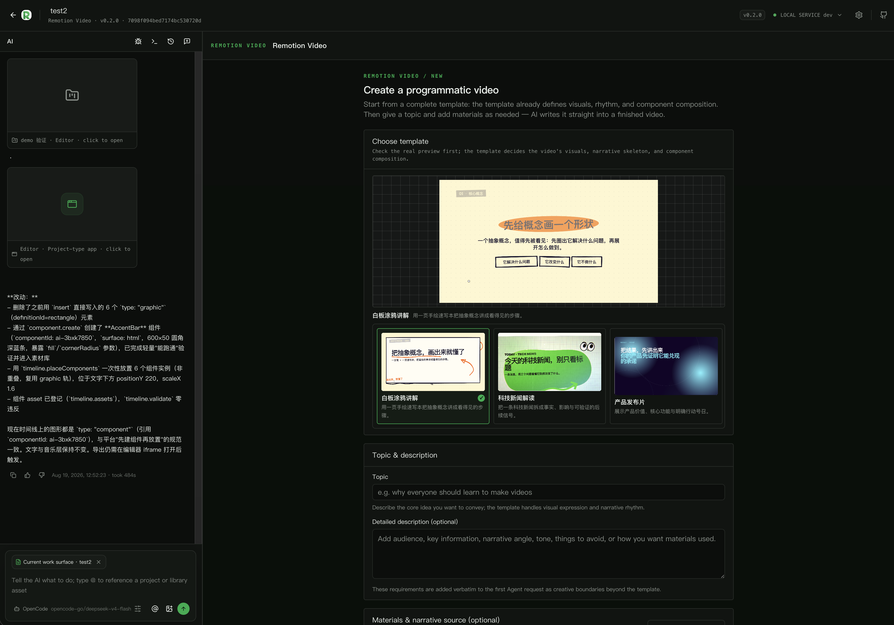

<div align="center">


# Remotion Studio

**Turn topics, copy and materials into Remotion programmatic videos — code is design, preview hot-reloads**

One Remotion workspace per project; AI rewrites composition code and renders locally

[中文](./README.md) · **English**

</div>



## What it is

Remotion Studio is Recut's **programmatic video App** (`project` type). Each project gets its own copy of `remotion-skeleton`: AI rewrites `workspace/src/compositions/ProjectVideo.tsx` directly, Vite hot-reloads the preview, and `@remotion/renderer` deterministically exports an MP4.

- **Template is the single source**: `faceless-explainer` / `product-launch` / `doodle-explainer`, visuals via `@recut/remotion-kit`.
- **Design is code**: reuse built-in effects & caption themes, reference real Assets via `resolveMediaUrl(assetId)` and `composition.assets`.
- **Preview = export**: `@remotion/player` preview and export share the same composition — no randomness, frame-identical.

> Ships with Recut. Published at [6174/recut-remotion-studio](https://github.com/6174/recut-remotion-studio).

## Why Remotion Studio

### Code-level control

Motion, beats and layout are reviewable, reusable and versionable.

### One workspace per project

`workspace.ensure` seeds the skeleton and links `node_modules`; projects don't interfere.

### Hot preview, local export

Edits hot-reload; export renders in local headless Chrome and archives as a media Asset (auto cover).

## From idea to finished video

1. **Brief** (`project.create`): pick a template, topic and optional materials.
2. **Ensure & serve** (`workspace.ensure` + `preview.serve.start`): Vite watches the workspace.
3. **Rewrite composition**: edit `workspace/src/compositions/ProjectVideo.tsx`, register Assets via `composition.assets`.
4. **Preview**: scrub the iframe player; fine-tune music & fonts.
5. **Export** (`render.export`): materialize Assets, render to MP4.

## Capabilities

| Capability | What you can do | Key operations |
| --- | --- | --- |
| **Brief & workspace** | Pick template, seed per-project Remotion workspace | `project.create` · `workspace.ensure` · `workflow.context` |
| **Preview** | Start/query/stop Vite preview, write props | `preview.serve.start/status/stop` · `preview.props` |
| **Media & registry** | Reference real Assets, register for export | `resolveMediaUrl(assetId)` · `composition.assets` |
| **Music & fonts** | Pick from CDN catalogs, instant preview, materialized export | `music.import` · `fonts.select` |
| **Export** | Local render to MP4, archive as cover | `render.export` · `render.status` · `export.list` |
| **Diagnostics** | Terminal, logs, kit version check | `terminal.exec` · `logs.read/list` · `workspace.kit-state` |

> Full contract: `manifest.json` → `operations`. Effects & captions: Skill references.

## Quick start

### Open in Recut

1. Install and launch Recut (see root [README](../../README.en.md#install-recut)).
2. Create a project → **Remotion Studio**, complete the Brief.
3. Start preview, rewrite composition, hot-reload, then export.

### Let the Agent help

> "Make a Remotion video about [topic]. Complete the Brief, read the remotion-studio skill, confirm effects & caption theme, then rewrite `workspace/src/compositions/ProjectVideo.tsx`, register Assets via `composition.assets`, save and wait for preview confirmation before export."

## Tour

- **Left**: iframe preview (`@remotion/player` with scrubbing).
- **Top right**: template → params → prompt → Agent; music & font fine-tuning.
- **Bottom right**: terminal / logs tabs.
- **Export & maintenance**: export modal; open folder, restart/reset.


<sub>From template and Brief to code, Assets and preview.</sub>

## FAQ

**Preview not updating?** Check `preview.serve.status` is running; saves hot-reload via Vite. Restart with `preview.serve.start` if needed.

**No audio on export?** Music must be materialized via `music.import` first; export is rejected while import is pending.

**Reset project?** `workspace.reset` restores the skeleton (loses AI edits — test/rollback only).

## For developers

Per-project workspace with pnpm content-addressed store.

```sh
make app-link APP=apps/remotion-studio
make dev
cd apps/remotion-studio/ui && npm ci && npm run build
cd apps/remotion-studio/remotion-skeleton && corepack pnpm@8.15.0 install
```

- Runtime entry: `ui/dist/index.html`; workspace is project-private.
- Contracts: `manifest.json` · `background.js` · `skills/remotion-studio/SKILL.md`.

[Back to root README](../../README.en.md) · [App map](../../README.en.md#app-map)
