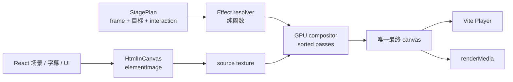
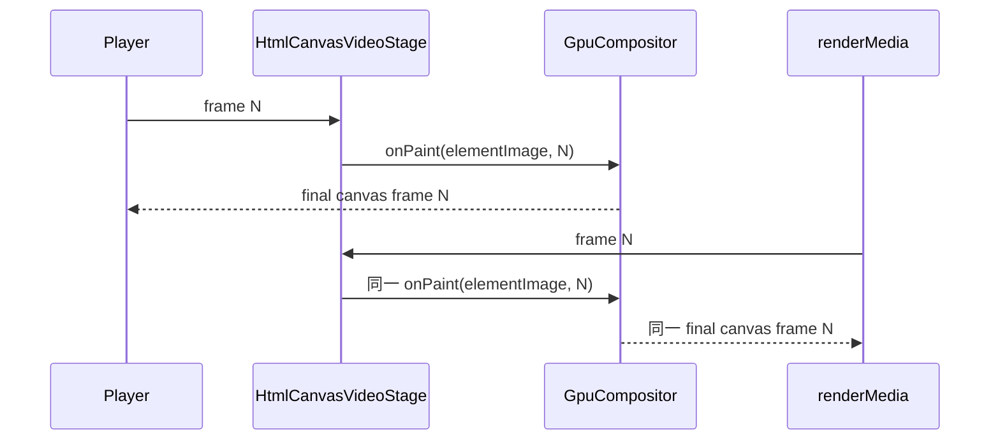

# GPU Expression Compositor 重设计

> 状态：已被 `2026-08-09-canvas-ui-effect-adapter-study.md` 取代。此前的“单一万能 compositor + 每帧 capture/upload”与 CanvasUI 的 source-dirty / effect-specific adapter 模型不符，不能继续作为实现依据。  
> 取代范围：`html-canvas` 当前“默认 HtmlInCanvas 内容画布 + Canvas 2D EffectOverlay”实现；保留其 `StagePlan`、目标几何与帧驱动交互合同。  
> 不取代：普通 Remotion 动画、`BackgroundFX`、字幕主题、`@remotion/transitions` 的既有非 Canvas 用法。  
> 上一版计划：`2026-08-09-html-in-canvas-expression-effects-plan.md`。本文件修正其把像素处理错误设计成透明 overlay 的问题，并纠正 CanvasUI 并非纯 MIT 的许可证事实。  
> [PROTOCOL]: 变更时更新此头部，然后检查 README.md

## 1. 决策

镜头层不再是“在 HTML 上多盖一张 Canvas”。它是一个**单捕获、单 WebGL2 合成器**：HTML 是每帧输入纹理，CanvasUI 效果是可排序的图像处理 pass，最终只输出一张合成后的 canvas。

这条决策是 Bubble、Glitch、Magnify 和翻页能成为真实镜头语言的前提：它们都必须读取并改写内容像素。仅在上层绘制圆环、文字、色块，永远无法产生折射、撕裂、波纹或页面折叠。

### 已实施记录

- `BrowserCapabilityGate` 已收敛至 `HtmlInCanvas.isSupported()`，删除 `captureElementImage` 的错误额外门槛。
- `HtmlCanvasVideoStage` 已改用 `onInit/onPaint`；`GpuCompositor` 在同一 OffscreenCanvas 中用 `texElementImage2D(elementImage)` 上传 source texture、以两个 FBO 执行排序 pass，并在 cleanup 释放所有 GPU 资源。
- Cursor / Focus / TextSelection / Ambient 作为透明 overlay texture pass；Magnify、Glitch、Bubble 作为 image pass。Bubble 每帧从 InteractionScript 确定性采样 `uTrail[]`，Glitch 使用 clip id 和 frame 生成稳定 seed。
- catalog 已只发布已实现的 7 项效果；旧 `scene-transition` card 已撤下，单输入 StagePlan 遇到它会显式报错而非伪造转场。
- `render.js` 已显式选用 ANGLE，并允许 `RECUT_REMOTION_GL=swangle` 作为无 GPU 诊断路径。



## 2. 设计约束

### 必须成立

1. `frame` 是唯一时钟。相同 composition、props 与 frame 必须产生相同像素；拖动、跳帧、并发渲染和重复导出不依赖历史帧。
2. 整支视频只有一个 `<HtmlInCanvas>`，不使用服务器端尚不支持的嵌套 capture。
3. 图片处理直接消费 Remotion 在 `onPaint` 传入的 `elementImage`，通过 `texElementImage2D()` 上传纹理；不从页面上的另一个 canvas 反向 `drawImage()`。
4. WebGL 资源只在 `onInit` 创建、在 cleanup 销毁；任何 effect 都不能单独创建 context、`requestAnimationFrame` 或 `ResizeObserver`。
5. 预览与导出走同一 compositor。浏览器或 GPU 能力不足时是明确诊断，不伪装为无效果 DOM 预览。
6. CanvasUI 只作为视觉与架构参考。其当前许可证含 Commons Clause，不复制或移植源码/shader；Recut 独立实现效果内核。真实鼠标、滚轮、`performance.now()`、随机 burst 调度一律不能进入视频 runtime。

### 明确不做

- 不做任意 CSS selector / DOM measurement 驱动的目标发现；目标几何仍由场景以设计像素声明。
- 不把一个从 2D overlay 采样的“假 Magnifier”称为 CanvasUI Magnify。
- 不把真实双场景翻页塞进单输入 `EffectClip`；它属于 Transition adapter。
- 不在首批引入 WebGPU、复杂物理模拟或自由 shader 编辑器。

## 3. 先修复真实能力边界

当前 `BrowserCapabilityGate` 额外要求 `captureElementImage`，导致 CanvasUI 可运行的环境被 Recut 自己阻断。这是错误的双真相源。

| 规则 | 正确实现 |
| --- | --- |
| 准入判断 | 唯一调用 `HtmlInCanvas.isSupported()`。仅在 Remotion 自身 probe 抛错时显示该错误，绝不降回另一套功能检查。 |
| Chrome 提示 | 对齐官方当前要求：Chrome 149+，开启 `chrome://flags/#canvas-draw-element`。 |
| 预览宿主 | 平台负责固定受支持 Chromium 与 flag；用户不应靠手动改浏览器成为产品流程。 |
| Renderer | WebGL composition 显式选择 ANGLE；无 GPU 时提供 SwiftShader 诊断路径。 |

官方接口与导出要求见 [Remotion HTML-in-canvas](https://www.remotion.dev/docs/html-in-canvas) 及 [HtmlInCanvas API](https://www.remotion.dev/docs/remotion/html-in-canvas)。

## 4. 目标架构

### 4.1 单一舞台

`HtmlCanvasVideoStage` 成为唯一 capture owner。它读取 Remotion frame，保有稳定的 `frameRef` 与 `planRef`；`onPaint` 回调本身保持稳定，避免每帧重建 GPU 世界。

```tsx
export const HtmlCanvasVideoStage: React.FC<Props> = ({plan, children}) => {
  const frame = useCurrentFrame();
  const frameRef = useLatest(frame);
  const planRef = useLatest(plan);
  const gpuRef = useRef<GpuCompositor | null>(null);

  const onInit = useCallback((args) => {
    gpuRef.current = createGpuCompositor(args.canvas);
    return () => gpuRef.current?.destroy();
  }, []);

  const onPaint = useCallback(({elementImage, pixelDensity}) => {
    gpuRef.current?.paint({
      elementImage,
      frame: frameRef.current,
      plan: planRef.current,
      pixelDensity,
    });
  }, []);

  return <HtmlInCanvas onInit={onInit} onPaint={onPaint}>{children}</HtmlInCanvas>;
};
```

`InteractionProvider` 仍在 capture 内容内：它把同一条 `InteractionScript` 派生成 scene 所需的 hover / press / scroll 语义状态。合成器另行调用相同纯函数，取得完整 pointer 与 clip 状态。两者不能各自演算不同的互动真相。

### 4.2 Pass 模型

每帧并不执行“一个效果画一张透明 canvas”，而是构造按 `zIndex` 排序的 pass 链。每个 pass 读取当前图像纹理并写入目标纹理，之后交换 ping-pong FBO。

```text
elementImage
  → source texture
  → base copy
  → focus overlay pass
  → magnify image pass
  → glitch image pass
  → cursor / HUD overlay pass
  → default framebuffer（最终 canvas）
```

三种 pass 足够覆盖而不混淆职责：

| Pass | 输入与输出 | 用途 | 首批效果 |
| --- | --- | --- | --- |
| `image` | 输入纹理 → 输出 FBO | 修改已存在的像素。 | Magnify、Glitch、Bubble、Glass、Ripple、VHS。 |
| `overlay` | 输入纹理 + 透明 layer → 输出 FBO | 画不需要读取邻近页面像素的引导图形；2D layer 上传为纹理后由 GPU 混合。 | Cursor、Focus、TextSelection、grain、HUD。 |
| `transition` | 两个 scene 输入 → 输出 FBO | 真正的 A→B 合成。 | Page turn、Peel、Bend、跨场景 ripple。 |

`overlay` 可以使用一个由 compositor 管理的 `OffscreenCanvas` 生成圆环、路径和文字，但它绝不直接成为最终显示层。上传为纹理并插入同一 pass 链，才可以正确位于 magnifier 前后，且不会再把采样能力错误放进 overlay。

### 4.3 GPU 资源所有权

`GpuCompositor` 是唯一允许持有 WebGL2 state 的对象：

```text
html-canvas/
  GpuCompositor.ts              onInit/onPaint/destroy 与 pass 执行器
  gpu/
    gl-program.ts               编译、链接、错误信息、uniform cache
    texture-pool.ts             source/overlay/FBO ping-pong 的尺寸与复用
    quad.ts                     全屏三角形与标准 blend
    color.ts                    sRGB、premultiplied alpha、Y flip 约定
  effects/
    cursor-overlay.ts           overlay pass
    focus-overlay.ts            overlay pass
    text-selection-overlay.ts   overlay pass
    magnify.ts                  独立 image pass（参考 CanvasUI 的视觉目标）
    glitch.ts                   独立 image pass（参考 CanvasUI 的视觉目标）
    bubble.ts                   独立 image pass（参考 CanvasUI 的视觉目标）
  transitions/
    page-turn.ts                Transition adapter，不进入普通 effect registry
```

每一帧只更新 texture 和 uniform；不重复编译 shader、创建 buffer、生成 DOM 节点或申请 FBO。`destroy()` 必须删除 program、texture、framebuffer、renderbuffer、buffer、VAO 和 overlay canvas 引用。

## 5. 核心合同

保留现有 `StagePlan` 的时序、目标与 interaction 价值，但替换当前 `CanvasEffect.render(ctx)` 合同。

```ts
type EffectStage = "image" | "overlay";

type GpuEffectDefinition = {
  id: EffectId;
  stage: EffectStage;
  scope: "component" | "scene" | "video";
  cost: "local" | "full-frame" | "heavy";
  schema: EffectSchema;
  // onInit 一次；资源归 GpuCompositor 生命周期所有。
  setup?: (gpu: GpuContext) => EffectResources;
  // 每帧纯粹由 frame、clip、interaction 与输入纹理决定输出。
  render: (pass: EffectPassContext, runtime: EffectRuntime) => void;
  // 允许 compositor 对局部效果使用 scissor，扩大值包括 blur/refraction 外溢。
  getDamageBounds?: (runtime: EffectRuntime, size: Size) => Rect | "full";
};

type EffectPassContext = {
  gl: WebGL2RenderingContext;
  input: TextureHandle;
  output: FramebufferHandle;
  overlay: OverlayTextureHandle;
  frame: number;
  fps: number;
  size: Size;
  pixelDensity: number;
  interaction: InteractionState;
  seed: number; // stableHash(clip.id)，不使用 Math.random()
};
```

不变的合同：

- `EffectTiming` 继续表达 `enter → play → exit`。
- `InteractionEvent` 继续表达 move / hover / click / drag / scroll。
- `FocusTarget` 和 text token `Rect[]` 继续使用 composition 设计像素。
- `resolveActiveEffects()` 与 `resolveInteractionState()` 继续是无副作用纯函数。

新增的关键约束：所有效果必须是 `F(frame, sourceTexture, plan)`。不得读取上一帧 FBO 内容来维持状态。这样 renderer 即使跳帧或并行，也不会让 Bubble 尾迹、Glitch burst 或 ripple 变形。

## 6. 当前动画模式如何进入 GPU

Remotion / React 动画仍然负责内容：标题入场、字幕、数字变化、场景切换照旧通过 `useCurrentFrame()`、`interpolate()`、`spring()` 产生 DOM。HTML-in-Canvas 在该帧将结果 capture 为 `elementImage`。

GPU 只负责对这一帧已排版结果做后处理：

| 当前动画能力 | 继续所在层 | GPU 如何参与 |
| --- | --- | --- |
| 场景内标题、卡片、数字进入 | React / SceneEngine | 捕获最终排版，不重写组件动画。 |
| hover / pressed 的 UI 变化 | `InteractionProvider` | 与 cursor/lens 共用 `InteractionState`。 |
| 光标、聚焦、选择 | StagePlan + overlay pass | 以同帧几何生成透明 layer，再混合。 |
| 折射、撕裂、液态、色差 | StagePlan + image pass | 读取前一 pass 纹理，输出新纹理。 |
| A→B 翻页 | TransitionPlan | 同时拥有前后 scene 输入；不伪装成单输入特效。 |

### 确定性替换表

| CanvasUI 网页行为 | 视频等价物 |
| --- | --- |
| `pointermove` | `InteractionEvent.move` 关键帧；路径插值由 frame 计算。 |
| 平滑跟随 / 尾迹状态 | 从当前 frame 向前固定采样 N 个脚本位置，或使用解析式低通；不累积前帧状态。 |
| `requestAnimationFrame` / `performance.now()` | `seconds = frame / fps`。 |
| `Math.random()` burst | `stableHash(clip.id, burstIndex)`；burst 区间显式写入 StagePlan。 |
| click ripple array 随时间 push/remove | `RippleEvent[]`；每个 ripple 的半径和透明度只由 `frame - startFrame` 求值。 |
| ResizeObserver | `onPaint` 的 logical size / pixelDensity；仅在尺寸变化时重建 texture pool。 |

Bubble 是最容易犯错的例子：不把 CanvasUI 的跟随数组直接搬入 React state。输入脚本定义鼠标轨迹，compositor 在当前帧确定性地算出 N 个历史 sample，再将它们作为 `uTrail[]` 上传给 metaball shader；光滑、拖尾、停下回收依然存在，但没有时间依赖的隐藏状态。

## 7. 关键效果的正确落点

### Magnify：第一张验证 shader

独立实现具有 live texture、HUD、色散、haze 与 click ripple bend 的 Magnify。需要保留的不是圆形裁剪，而是：

1. `elementImage → source texture`；
2. lens 内按 `p / zoom - rippleOffset` 重新采样输入纹理；
3. 透镜边缘按半径增加色差和 haze；
4. click ripple 同时扭曲**透镜外的整页**；
5. HUD 作为同一 pass 或邻接 overlay pass 合成。

这会验证 source texture、局部伤害区域、interaction、多个 pass 和预览/导出一致性，故优先于 Bubble。

### Glitch：第一张全屏验证 shader

独立实现 horizontal slices、RGB split、corrupted blocks、analog noise。它是全帧 pass，特别适合验证 FBO ping-pong 和 deterministic seed。

`interval + random` 改为显式 `bursts: [{startFrame, durationFrames, seed}]`。每个 burst envelope 只计算当前 frame，不由上一次 render 触发。没有 burst 时必须是按位稳定的 source copy，避免“常驻脏画面”。

### Bubble：高成本主角

Bubble 是 metaball SDF、法线、折射、色散、rim、iridescence 的组合，而不是一串半透明圆。独立实现 fragment shader 后：

- 输入是当前 composite texture；
- `uTrail` 由确定性历史路径得到；
- 以 `getDamageBounds()` 扩张 bubble 轨迹、refraction 与 blur 后 scissor；
- 每个镜头最多一个 Bubble；与全屏 Glitch、重型过渡默认互斥；
- 第一期不做无限长轨迹或多 bubble 物理。

### 翻页、Peel、Bend：Transition adapter

“把静态页面折一下”可作为单输入 image effect；“从场景 A 翻到场景 B”则必须拥有两张输入。后一种不属于 `EffectClip`，而是 `TransitionPlan` + `@remotion/transitions` 的 custom HTML-in-canvas presentation。

```text
Scene A texture ─┐
                 ├─ PageTurn transition shader → output
Scene B texture ─┘
```

实施时要让根 composition 在转场窗口同时提供 A/B，而不是从已经合成的单张 `elementImage` 猜测前一场景。仍然只允许一个 capture hierarchy；不因翻页在子 scene 再创建 `<HtmlInCanvas>`。

## 8. 性能设计

性能策略不是“降低一切分辨率”，而是让未受影响的文字和 UI 始终保持 source 的原始清晰度。

### 8.1 资源预算

1080p 的一个 RGBA8 texture 约为 7.9 MiB。基础工作集为 source + 两张 ping-pong + overlay，约 31.6 MiB；只在需要 image pass 时分配 ping-pong，空效果不创建它们。4K 时同一工作集约 126 MiB，因此 4K 必须实施显式预算和拒绝策略。

| 资源 | 规则 |
| --- | --- |
| source texture | 由 `elementImage` 每帧上传；大小等于 logical size × `pixelDensity`。 |
| ping-pong FBO | 懒创建且最多两张；pass 结束立即复用。 |
| overlay texture | 一张透明 texture；仅有 overlay effect 时上传。 |
| mipmap | 默认关闭；只在 Bubble / Magnify haze 真的采样 LOD 时生成。 |
| 局部 effect | 先 copy source，再以扩张 damage bounds 开启 scissor；避免 Bubble 每帧跑全屏。 |
| 全屏 effect | Glitch / VHS / transition 显式标记 `full-frame`，不得与多个 `heavy` pass 无限制叠加。 |

### 8.2 组合上限

| 组合 | 首期上限 | 原因 |
| --- | --- | --- |
| `heavy` image effect | 1 个 | Bubble 与 PageTurn 都足以成为镜头主角。 |
| `full-frame` image pass | 2 个 | 例如 Glitch + 色彩处理；超过后先合并 shader 再开放。 |
| overlay pass | 3 个 | cursor、focus、selection 可合为一张 overlay texture。 |
| transition | 1 个活动窗口 | 两场景纹理与页面几何已占主要预算。 |

registry 必须声明 `cost`，resolve 阶段若发现不合法组合，开发期抛带 clip id 的错误；生产 UI 不提供会生成无效组合的选择。这比在 render 热路径塞 if/else 更干净。

### 8.3 目标与仪表

首期在目标机器上记录而非猜测：1080p / 30fps，单个 Magnify、单个 Glitch、单个 Bubble、Bubble+Cursor、PageTurn 的 GPU pass 时间、纹理峰值、60 秒导出峰值内存。初始发布门槛：单 effect P95 不挤占一帧 33.3ms 的大部分预算，连续 60 秒无 texture/context 增长；具体毫秒阈值以基准机器第一次测量后写入 CI。

调试 build 暴露只读 `CompositorStats`：活动 pass、texture bytes、draw calls、scissor 覆盖比例、最近 shader 错误。它不进入视频画面，也不成为导出逻辑的分支。

## 9. 预览、导出与错误模型



- Player：平台检测通过才挂载。失败信息说明 `HtmlInCanvas.isSupported()`、Chrome/flag、WebGL2 的具体失败点。
- Renderer：在 `render.js` / `remotion.config.ts` 显式配置 ANGLE；若无硬件 GPU，允许受控 SwiftShader 路径，但需把渲染器选择写入日志。
- Shader：`onInit` 编译失败立即抛 effect id、shader stage 和 renderer 诊断；不显示没有效果的普通 DOM 画面。
- Source：首次 `onPaint` 前不能宣称 ready；`elementImage` 上传失败时阻断该 composition frame。
- 颜色：统一 `UNPACK_FLIP_Y_WEBGL`、premultiplied alpha 与 sRGB 约定；每个移植 shader 在视觉测试中校验透明边缘和 RGB split。

## 10. 迁移路径

### Phase 0：止血与基线

1. `BrowserCapabilityGate` 改为唯一使用 `HtmlInCanvas.isSupported()`，移除 `captureElementImage` 依赖与 Chrome 148 文案。
2. 为 Vite Player 和 renderer 建立 60 帧 native probe composition，确认 HTML、中文字体、透明背景、图片和 WebGL2。
3. 配置 ANGLE / SwiftShader，并记录实际 Chromium / GPU renderer。
4. 修正 `html-canvas-tests` 的 Node 版本或测试加载器；当前 Node 20 无法导入 `registerHooks`，绿色测试并不成立。

### Phase 1：Compositor 骨架（不新增华丽效果）

1. 新建 `GpuCompositor`、texture pool、shader utility、标准 copy pass、overlay texture pass。
2. 将 `HtmlCanvasVideoStage` 改接 `onInit` / `onPaint`；删除 content canvas 反向采样依赖。
3. 保留 `types.ts`、`timeline.ts`、`targets.ts`、`interaction.ts`；将 `CanvasEffect` 演进为 `GpuEffectDefinition`。
4. 将 Cursor / Focus / TextSelection 先变成 overlay pass，验证 zIndex、DPR、透明度和 hit geometry。

验收：无 image effect 时，最终 GPU copy 与原 HTML 帧一致；在 16:9、9:16、1:1 的固定帧视觉快照均通过。

### Phase 2：Magnify 与 Glitch

1. 以 CanvasUI demo 的视觉验收为参考，独立实现 shader；记录上游 commit 与许可证边界，不复制源码。
2. 先实现 Glitch（全帧、确定性 burst），再实现 Magnify（局部、HUD、ripple bend）。
3. 每项提供 canonical fixture、视觉 snapshot、两次导出像素 hash 和性能记录。

验收：Magnify 的透镜内外都能看见真实内容采样差异；Glitch 能撕裂当前 DOM 内容而不是在顶部画彩条。

### Phase 3：Bubble 与组合规则

1. 移植 Bubble SDF/refraction shader，脚本路径转换为确定性 `uTrail[]`。
2. 加入 damage bounds / scissor、`heavy` 组合限制和 runtime stats。
3. 在 Studio catalog 标出性能等级与推荐镜头长度；不允许 Agent 给每个 scene 都塞 Bubble。

### Phase 4：双场景转场

1. 引入 `TransitionPlan` 与 root-level transition adapter。
2. 用 Remotion custom HTML-in-canvas presentation 实现最小 PageTurn / Peel；先只支持一个转场窗口。
3. 补 A/B 双输入、透明、不同画幅和 renderer 的视觉回归。

### Phase 5：产品入口与旧实现删除

1. `EffectsFineTune` 从“六张效果卡”转为读取真实 `cost`、`stage`、参数 schema 与 fixture。
2. Agent prompt 明确区分 image effect、overlay effect、transition，禁止独立 demo 粘贴。
3. 在两个模板使用真实用例后，删除旧 `EffectOverlay`、`contentCanvas` API 以及伪 `SceneTransition`。

## 11. 测试与验收矩阵

| 层级 | 测试 | 通过条件 |
| --- | --- | --- |
| 纯函数 | timing、target、interaction、stable hash、trail sampling、burst envelope。 | 任意 frame 无 NaN、无历史状态、边界稳定。 |
| GPU 单元 | shader 编译、uniform schema、texture pool resize、destroy。 | 无资源泄漏，错误带 effect id。 |
| 视觉 | Glitch / Magnify / Bubble / PageTurn 的关键帧 PNG。 | 与批准的 golden image 比对；文本边缘、透明度、RGB split 可见。 |
| 确定性 | 同 props/frame 两次 render；跳帧顺序与连续顺序比对。 | 像素 hash 一致。 |
| 集成 | Player、`renderMedia`、16:9/9:16/1:1、ANGLE/SwiftShader。 | 同一帧结果一致或在预先批准的 GPU 容差内。 |
| 性能 | 1080p 60 秒、单/组合 effect、纹理 bytes 与 context count。 | 不超过已发布的预算；无随帧增长。 |
| 产品 | catalog、FineTune、Agent 输出。 | 用户选择的 effect 只能生成有效 Plan；不生成假 demo 或嵌套 capture。 |

## 12. 文件职责与删除清单

| 当前文件 | 处理 | 原因 |
| --- | --- | --- |
| `HtmlCanvasVideoStage.tsx` | 重写 | 从 default onPaint + sibling overlay 改为 onInit/onPaint GPU owner。 |
| `EffectOverlay.tsx` | 删除或迁移为内部 overlay texture builder | 它不能再显示为独立最终 canvas。 |
| `CanvasEffect.tsx` | 替换为 `GpuEffect.ts` | `CanvasRenderingContext2D` 不是像素特效的执行合同。 |
| `magnifier.tsx` | 重写 | 采用 source texture shader，保留 StagePlan 参数语义。 |
| `scene-transition.tsx` | 删除后以 Transition adapter 取代 | 单输入 canvas 无法实现真实 A→B。 |
| `cursor/focus/text-selection/ambient` | 迁移 | 成为可排序 overlay texture pass，不失去现有叙事能力。 |
| `BrowserCapabilityGate.tsx` | 修复 | 回归 Remotion 的唯一能力判断。 |

## 13. 最终原则

数据从 `StagePlan` 单向流向 effect resolver，再流向 compositor；内容场景不感知 GPU 生命周期，shader 不感知真实浏览器交互，transition 不假装是单场景 overlay。

这样新增一个效果时，只增加一个定义明确的 pass 与视觉 fixture，不增加一套 canvas、时钟、能力探针和例外分支。镜头层才能从一组看起来很酷的 demo，变成 Remotion Studio 可扩展、可导出、可审片的基础能力。
