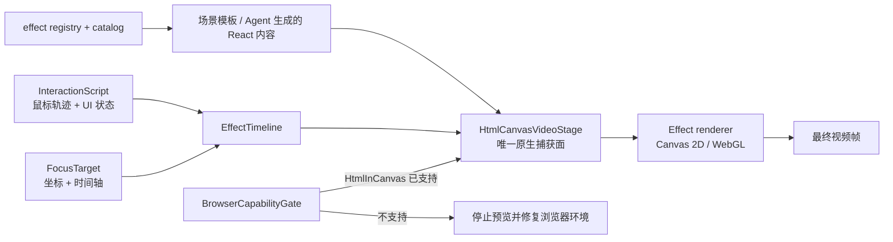
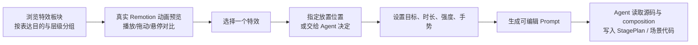

# HTML-in-Canvas 表达镜头组件计划

> 目标：把 HTML-in-Canvas 设为 Remotion Studio 的浏览器硬能力，并以它把实时 HTML 内容转化为可编排的“表达镜头”——由鼠标驱动的模拟交互、聚焦、文本选择、放大镜、场景进出与背景特效——同时保持逐帧确定性和预览/导出一致。

日期：2026-08-09
状态：第一批（A + B 最小闭环）已实施，后续批次按计划推进
范围：`apps/remotion-studio/` 的 `@recut/remotion-kit`、项目骨架、组件目录与 Agent 创作入口。

## 实施记录（第一批）

- Phase 0 + Phase 1 已落地：`packages/remotion-kit/src/html-canvas/`（types/timeline/targets/interaction/InteractionScript/EffectTimeline/BrowserCapabilityGate/HtmlCanvasVideoStage/CanvasEffect/registry），纯函数单测 `scripts/html-canvas-tests.mjs`（14 项通过）。
- Phase 2 第一批：CursorDirector、FocusSpotlight 已完成；TextSelection、Magnifier、SceneTransition、AmbientCanvasFX 作为同一 adapter 的 paint renderer 一并提供。
- Phase 3：`catalog.json` 新增 `effects` 目录（6 项，含 engine/layer/placement/source/prompt），UI 新增 `EffectsFineTune`（真实 Player 预览 + 位置编辑器 + 可编辑 Prompt），`preview/compositions.tsx` 新增 `effect` 预览 kind；`ProjectVideo` 支持可选 `stagePlan` 并在唯一捕获面路由场景。
- 叙事实例：`demos/product-ui-demo.tsx`（产品 UI click → focus 演示，含 move → hover → click → pause 手势）。
- 三个场景模板自带可开关的 StagePlan（`stagePlan` prop：undefined = 启用内置用例 / null = 关闭）：product-launch 两处 click → magnify（数据时刻）、faceless-explainer 的 concept hover → selection + data 焦点、doodle-explainer 的 conclusion focus + ambient。模板自身创建唯一捕获面，骨架 ProjectVideo 只透传不再包裹。
- kit 版本 0.4.0 → 0.5.0；`./html-canvas` subpath 导出与 skeleton vite 别名已就绪。

## 结论先行

HTML-in-Canvas 是本产品的核心差异化，不是可有可无的渐进增强。它的价值不在于“用 Canvas 替代 React”，而在于把**已经正确排版的 HTML**作为一张可被 Canvas 2D、WebGL 或 WebGPU 后处理的动态纹理。由此视频可以拥有原生网页表达中才有的“镜头感”：鼠标靠近、悬停、点击、拖拽、放大、选择和波纹，不再只是屏幕录制加一个 CSS 光标。

因此应建立一个独立的 `html-canvas` 舞台，而不是继续向 `BackgroundFX` 的 `switch` 或现有的 81 个演示模板塞入硬编码效果。该层以“HTML 场景 + 明确目标几何 + 帧驱动互动脚本 + 全局效果轨”为输入，只走原生 HTML-in-Canvas 渲染。所有效果共用同一坐标、时间、互动和 shader 生命周期合同；新增效果只是增加一个小型 renderer，而不是复制一套浏览器探测、动画和资源管理逻辑。

CanvasUI 是 MIT 开源的效果语言与实现参考，特别是其 Magnify 的“live DOM texture + WebGL 叠层”结构；但它面向真实鼠标、滚轮、`requestAnimationFrame`、`ResizeObserver` 和交互网页。视频需要反过来：**Remotion frame 是唯一时钟，互动脚本是唯一真相源**。我们可以直接参考并按组件移植其源码，但必须保留 MIT 声明、固定上游 commit，并把交互循环改造成确定性的 effect adapter。

## 现状与事实

| 事实 | 含义 |
| --- | --- |
| `remotion-skeleton`、Studio UI 和 kit 都使用 Remotion `4.0.507`。 | 高于 [`<HtmlInCanvas>` 在 v4.0.455 加入](https://www.remotion.dev/docs/html-in-canvas)的版本，无需先升级 Remotion。 |
| 项目预览由 Vite + `@remotion/player` 在宿主浏览器执行；导出由 `@remotion/renderer` headless Chrome 执行。 | HTML-in-Canvas 必须成为宿主浏览器的硬能力；预览不支持时必须阻断创作，不存在 DOM/CSS 降级模式。 |
| 现有 `BackgroundFX` 是固定背景的 `switch`，`TextHighlight`、`SpotlightReveal` 是带固定文案和整屏画面的演示模板。 | 它们不可作为通用基础设施；改造会把演示代码、场景语义和底层渲染耦在一起。 |
| `PageCam` 处理的是图片纹理上的页面相机，不是可被后处理的 live DOM。 | 它可与新层组合（例如截图页上的聚焦），但不替代 HTML-in-Canvas。 |
| kit 会冻结拷贝进每个项目 workspace，预览和导出都别名到该副本。 | 新能力必须放进 `packages/remotion-kit` 并提高 kit 版本；不能只改 skeleton，否则新旧项目行为漂移。 |

上游能力边界（本计划以 2026-08-09 文档为准）：

- Remotion 的 `<HtmlInCanvas>` 提供 `onPaint({ canvas, element, elementImage })`；可用 Canvas 2D 的 `drawElementImage()`，也可接 WebGL/WebGPU 后处理。
- 浏览器预览要求 Chrome 149+ 并启用 `chrome://flags/#canvas-draw-element`；该 API 仍是实验性能力，运行时可用 `HtmlInCanvas.isSupported()` 检测。本产品将此检测作为准入门禁，而非 fallback 分支。
- Remotion 从 v4.0.455 起支持本地、Studio、Lambda、Vercel 和服务端渲染，并为导出提供已启用 flag 的 Chrome；含 WebGL shader 时建议显式使用 ANGLE，无 GPU 时使用 SwiftShader。
- 嵌套 `<HtmlInCanvas>` 的预览与客户端渲染要求 Chrome/Chromium 152.0.7944.0+；服务器端嵌套暂不支持。v1 绝不依赖嵌套。
- [CanvasUI](https://canvasui.dev/docs/) 是 MIT 开源组件库，大多采用“live HTML → canvas texture → WebGL effect”；其网页交互循环不能直接进入视频 renderer，需要保留来源声明并改写为帧驱动 effect adapter。

## 设计目标与非目标

### 目标

1. 同一份 composition 在拖动 Player、逐帧导出和重渲染时得到一致的画面。
2. 预览入口在 HTML-in-Canvas 不可用时明确停止，并说明由平台负责的浏览器环境修复路径；绝不以普通 DOM 画面伪装成功。
3. 鼠标运动、悬停、点击、拖拽与界面状态由同一份可审阅的互动脚本驱动；它在每次重渲染中产生同一条体验轨迹。
4. 单个组件的进入、播放、退出，与跨组件/跨场景的镜头层严格分离，却共享同一条全局时间轴。
5. 所有焦点由显式、可审阅的 `target` 描述，不靠 CSS selector 扫描或不稳定的 DOM layout 读回。
6. 效果可组合在任意 React 内容之上，能够被场景模板、Agent 和组件目录发现。
7. 一次性解决 shader 初始化、DPR、透明背景、颜色空间、资源释放和 renderer 参数，而不是每个效果各写一遍。

### 非目标

- v1 不尝试支持不具备 HTML-in-Canvas 的浏览器，也不提供效果降级或无特效预览。
- v1 不做真实事件回放；鼠标、滚轮、点击、滚动、输入和拖拽都由帧驱动的互动脚本模拟。
- v1 不做嵌套 HTML-in-Canvas，不承诺 Firefox/Safari，也不引入 WebGPU 作为必要条件。
- v1 不把 CanvasUI 的全部组件搬进来；按表达价值逐项移植 MIT 源码，不添加一个重量级“效果平台”依赖，也不把任意用户 HTML 当成安全或稳定的 renderer 输入。
- 不修改已有 `BackgroundFX`、`PageCam`、`TextHighlight`、`SpotlightReveal` 的行为；新 API 先并存，稳定后再按需迁移场景。

## 目标架构



建议新增下列目录（实施时创建，届时同步 L2/L3 文档）：

```text
packages/remotion-kit/src/html-canvas/
  types.ts              公共契约：坐标、关键帧、效果、鼠标与互动状态
  timeline.ts           帧 → 归一化进度 / 目标插值；不含渲染副作用
  targets.ts            坐标换算、矩形/圆形/路径 target 的纯函数
  BrowserCapabilityGate.tsx 浏览器硬门禁；不支持时禁止 Player 挂载
  HtmlCanvasVideoStage.tsx 整支视频唯一的 HtmlInCanvas 捕获面与总合成器
  EffectTimeline.tsx    解析局部生命周期与全局层级轨，向 paint 提供当前帧状态
  InteractionScript.tsx 帧驱动鼠标、click/hover/drag/scroll 与语义 UI 状态
  CanvasEffect.tsx      原生 paint renderer 的适配边界
  effects/
    focus-spotlight.tsx 焦点遮罩、羽化和边缘光
    text-selection.tsx  文本选择、荧光笔与逐词/逐段推进
    magnifier.tsx       鼠标/关键帧驱动放大镜、HUD 与可选色差
    cursor.tsx          原生鼠标、hover halo、click ripple、drag trail
    scene-transition.tsx 场景 enter / exit 的 capture-space 转场
    ambient.tsx         可复用轻量背景：grain、vignette、soft blur
  gl/                   仅在确需 WebGL 时放置最小 shader/texture 生命周期工具
  index.ts              子模块稳定导出
```

`src/effects/` 继续服务“整片背景与文字动画”；`src/html-canvas/` 服务“把整支成片放进唯一的原生捕获面，再以轨道处理局部和全局镜头”。单个组件绝不各自包一层 `<HtmlInCanvas>`：嵌套在服务器导出尚不支持，且会令局部效果无法自然参与全局鼠标、放大镜和场景转场。这样一个字幕卡、产品 UI、数据表或自定义 React 片段都能进入同一个表面，而不会被背景效果的 palette contract 绑死。

### 核心合同

```ts
type Rect = { x: number; y: number; width: number; height: number };

type FocusTarget =
  | { kind: "rect"; rect: Rect; radius?: number }
  | { kind: "circle"; cx: number; cy: number; radius: number }
  | { kind: "path"; points: Array<{ x: number; y: number }> };

type EffectTiming = {
  startFrame: number;
  enterFrames: number;
  holdFrames?: number;
  exitFrames: number;
};

type HtmlCanvasEffectProps = {
  target: FocusTarget;
  timing: EffectTiming;
  /** 与 composition 一致的设计像素；禁止从 pointer 或 DOM 查询推断。 */
  width: number;
  height: number;
};

type InteractionEvent =
  | { kind: "move"; frame: number; x: number; y: number; easing?: string }
  | { kind: "hover"; frame: number; targetId: string }
  | { kind: "click"; frame: number; targetId: string }
  | { kind: "drag"; startFrame: number; endFrame: number; from: { x: number; y: number }; to: { x: number; y: number } }
  | { kind: "scroll"; frame: number; targetId: string; offsetY: number };

type EffectClip = {
  id: string;
  scope: "component" | "scene" | "video";
  effect: "cursor" | "focus-spotlight" | "text-selection" | "magnifier" | "scene-transition" | "ambient";
  target?: FocusTarget;
  timing: EffectTiming;
  zIndex: number;
};
```

坐标以 composition 的设计像素表达，不使用 `getBoundingClientRect()` 作为真相源。要选中文字时，场景在排版时就产生 token / line 的 `Rect[]`；`TextSelection` 只渲染这些位置。这个看似克制的合同能消除字体加载、缩放、headless layout 与 preview viewport 造成的分支：布局是内容的职责，效果只是处理已知几何。

`BrowserCapabilityGate` 的职责只有一件事：在 Player 和 Studio UI 之前验证原生能力。它只能允许或阻断，不得返回 fallback。平台必须负责使用并固定一个满足 Chrome 版本与 flag 要求的预览 Chromium；把用户送去手动改 `chrome://flags` 不能成为正式产品方案。

`HtmlCanvasVideoStage` 的职责只有四件事：包住全片唯一 `<HtmlInCanvas>`、解析 `EffectTimeline`、把 frame 派生的状态交给 effect、在卸载时释放 GPU 资源。它不理解“放大镜”或“选择文字”。每个 effect 都必须提供：

1. `renderNative(paint, state)`：只读 `frame` 派生状态，在 `onPaint` 完成确定性绘制；
2. `getBounds(state)`：用于裁剪、纹理尺寸与 snapshot 测试；
3. `schema`：限制参数范围，给 catalog、Agent 与未来表单共用；
4. `scope`：明确它只能是组件内部、当前场景或跨整支视频的层。

### 两种层级，统一时间轴

| 层级 | 解决的问题 | 生命周期 | 典型能力 |
| --- | --- | --- | --- |
| 组件内表达 | 一个组件如何出现、保持、退出。 | `enter → play → exit`，由组件自己的 `EffectTiming` 完整描述。 | 卡片入场、数字滚动、文字选中、按钮 hover、局部强调。 |
| 舞台效果层 | 镜头如何引导、连接或处理多个组件/场景。 | 使用全局 composition frame，可跨 Sequence 边界。 | 鼠标路径、放大镜、聚焦、scene enter/exit、转场、背景材质、全局色差。 |

组件负责内容与自身动画；舞台层只在 capture-space 操作最终 HTML 纹理。一个 `EffectClip` 在一个显式 `zIndex` 上运行，局部效果不必知道鼠标或转场存在，而 Cursor/Magnifier 也不需要侵入每一个产品卡片的 JSX。这是复用的关键：消灭“每个组件自己画一只鼠标、自己处理入出场、自己初始化一份 WebGL”的特殊情况。

### 如何接入现有 composition

当前 `remotion-skeleton/src/compositions/ProjectVideo.tsx` 只做模板路由；它正好应成为唯一的舞台接入点，而不是要求每个 `ProductLaunchVideo`、`FacelessExplainerVideo` 或 beat 组件自行理解 capture。实现后的结构应是：

```tsx
// ProjectVideo 仍负责选场景，但只能在这里创建唯一的 HtmlInCanvas 舞台。
return (
  <HtmlCanvasVideoStage plan={scenario.stagePlan}>
    <ScenarioVideo {...sceneProps} interaction={scenario.interactionAtFrame} />
  </HtmlCanvasVideoStage>
);
```

| 现有位置 | 新职责 | 禁止的变化 |
| --- | --- | --- |
| `remotion-skeleton/src/compositions/ProjectVideo.tsx` | 用 `HtmlCanvasVideoStage` 包住场景路由一次，接收 `StagePlan`。 | 不在每个 `if (scenario)` 分支复制 effect 判断。 |
| `packages/remotion-kit/src/scenarios/*/` | 各场景声明自己的 `stagePlan`：镜头轨、interaction script、scene 边界和 target 数据。 | 不直接 import `<HtmlInCanvas>`，不持有 WebGL context。 |
| `SceneEngine.tsx` 与 beat 原语 | 保持内容、布局及 `enter → play → exit`；通过 interaction state 改变按钮/卡片等语义状态。 | 不画 cursor，不处理跨场景转场。 |
| `html-canvas` stage | 按全局 frame 编排所有 effect clip，并把派生 interaction state 通过 Context/props 提供给 scene。 | 不写业务文案，不认识某个模板的布局细节。 |
| Studio UI / Agent | 生成或编辑结构化 `StagePlan`，与 SCENES 同时保存、审阅和测试。 | 不生成 CSS selector、浏览器事件回放脚本或游离坐标字符串。 |

`StagePlan` 是 composition 层的单一真相源，包含 `interaction: InteractionEvent[]`、`effects: EffectClip[]`、每个 target 的设计像素几何及 scene 边界。组件自己的入场数据仍留在各自 props 中；舞台计划绝不重复内容动画。这样的分工使“某张卡片进场”与“鼠标点击那张卡后，全片进入放大镜镜头”能独立演化并自然叠加。

## 特效板块：面向表达能力的核心工具

特效板块不是 HTML-in-Canvas 的设置页，也不是现有“动态组件”目录的又一个分类。它是 Studio 的一级创作工具：**组件回答“画面里有什么”，特效回答“观众如何感受、注意和理解它”。**

它收录 HTML-in-Canvas、Three.js、纯 Remotion/SVG 等不同引擎的表达能力；用户不需要先理解底层引擎，只需通过真实动效预览选择一种表达方式，再明确或委托 Agent 选择它应落在成片的什么位置。引擎差异只存在于实现 adapter，不应该泄漏为多套 UI 或多种 Prompt 格式。

### 特效定义：一份跨引擎目录合同

在 `catalog.json` 新增与 `components` 平级的 `effects`，而不是把 effect 塞回 `components`。最小定义如下：

```ts
type EffectDefinition = {
  id: string;
  label: string;
  description: string;
  engine: "html-canvas" | "three" | "remotion";
  layer: "interaction" | "content" | "scene" | "transition" | "background";
  intent: "guide" | "inspect" | "emphasize" | "connect" | "atmosphere";
  requires: Array<"html-in-canvas" | "webgl2" | "three">;
  placement: Array<"target" | "scene-enter" | "scene-play" | "scene-exit" | "between-scenes" | "video-background">;
  preview: { compositionId: string; durationInFrames: number; defaultProps: Record<string, unknown> };
  source: { exportName: string; path: string; workspacePath: string };
  prompt: { constraints: string[]; recommendedDurationFrames: number };
};
```

`engine` 只决定 runtime adapter：`html-canvas` 生成 `EffectClip` 并进入唯一捕获舞台；`three` 生成同一时间轴上的 3D layer；`remotion` 用于无 GPU 特殊需求的常规表达层。`layer` 和 `placement` 才决定它能否与鼠标、场景进出、背景或组件内生命周期组合。这样未来增加 Three.js 体积光、粒子或空间相机时，只是加入目录项和 adapter，不必重造“选择、预览、放置、Prompt”的整条产品链。

CanvasUI 的复用方式固定为“按组件移植、按 commit 追踪”：在 `packages/remotion-kit/third_party/canvas-ui/` 保留 MIT LICENSE 与来源清单；移植文件头部记录上游路径和 commit，业务改写只发生在 `html-canvas` adapter 中。这样既能直接利用 MIT 源码的成熟 shader/texture 处理，又不会让运行时依赖一个无法逐帧控制的网页交互循环。

### 用户工作流：选择 → 动画预览 → 放置 → Prompt



板块 UI 复用当前 `ComponentFineTune` 与 `CaptionsFineTune` 的“左侧目录、右侧真实 Player、选择后生成 Prompt”模式，但新建 `EffectsFineTune`，不污染组件选择器。推荐分组是：

| 表达目的 | 首批效果 | 常见放置位置 |
| --- | --- | --- |
| 模拟交互 | Cursor Director、Click Ripple、Drag Trail、Hover Halo。 | `scene-play` / `target` |
| 重点引导 | Focus Spotlight、Text Selection、Magnifier。 | `target` / `scene-play` |
| 场景节奏 | Scene Enter、Scene Exit、Focus Transition。 | `scene-enter` / `scene-exit` / `between-scenes` |
| 氛围背景 | Grain、Vignette、Glass、Three.js particles / volumetric light。 | `video-background` / `scene-play` |
| 空间表达 | Three.js camera move、depth parallax、3D object focus。 | `scene-play` / `scene-enter` |

每个卡片的预览必须是小型真实 Remotion composition，而非 GIF、截图或 CSS 假动画；选择或悬停后，在右侧用可播放、可拖动的 Player 展示 canonical fixture。这个 fixture 是视觉回归的素材，也让用户在写 Prompt 前看到完整的进入、播放、退出。HTML-in-Canvas 类预览同样经过 `BrowserCapabilityGate`，不能为了预览绕开产品硬要求。

### “放到什么位置”是语义选择，不是代码行选择

用户不应被要求在 JSX 文件中找行号，也不应让 UI 伪造一个并不了解的 DOM selector。选择效果后，板块提供一个位置编辑器：

1. **Agent 决定最佳位置**：默认值。Prompt 要求 Agent 先读 `SCENES`、`StagePlan` 与场景代码，选择叙事最需要的位置并解释原因。
2. **指定场景**：从 composition 已知 scene id 中选一个，再选 `scene-enter`、`scene-play`、`scene-exit` 或 `background`。
3. **连接两个场景**：选择前后 scene id，限定为 `between-scenes` transition。
4. **指定内容目标**：用户以自然语言说明“设置页右上角的导出按钮”“第二段标题中的关键词”；Agent 将其转为 scene-owned `FocusTarget`/`Rect[]`，并在 Prompt 中回报坐标与理由供审阅。
5. **指定互动**：选择 move/hover/click/drag/scroll，以及手势发生的相对时间；`CursorDirector` 与目标效果共用同一 `InteractionScript`。

最终 Prompt 必须包含 effect id、引擎、层级、推荐源码路径、位置意图、目标、时长、强度、HTML-in-Canvas 硬约束以及验收动作；它只能请求 Agent 修改当前 composition 的 `StagePlan` 和必要场景代码，不能要求盲目粘贴一个独立 demo。用户可在发送前编辑 Prompt，保持现有 Studio 的可审阅工作方式。

### UI 与数据落点

| 位置 | 新职责 |
| --- | --- |
| `packages/remotion-kit/catalog.json` / `scripts/gen-catalog.mjs` | 维护 `effects` 目录及上述跨引擎 metadata，成为 UI、skill、测试的单一来源。 |
| `ui/src/fine-tunes/EffectsFineTune.tsx` | 特效选择器、分组目录、完整 Player 预览、位置编辑器与 Prompt 组装入口。 |
| `ui/src/fine-tunes/effects/` | 拆分 `EffectBrowser`、`EffectPreview`、`EffectPlacement`、`EffectPrompt`，避免特效工具变成不可维护的大组件。 |
| `ui/src/preview/compositions.tsx` | 新增 `effect` preview kind 和固定 fixture composition；预览逻辑与项目实际导出同用 kit export。 |
| `ui/src/studio.tsx` | 把“特效”提升为与字幕、画布、组件并列的当前成片工具；不与“成片模板”混淆。 |
| `remotion-kit/src/html-canvas/` 与未来 `src/three/` | 分别实现 adapter；都消费同一 `EffectDefinition`/`StagePlan`，不拥有 UI。 |

### 能力全景与分批交付

系统设计覆盖所有引擎和层级，但目录中不等于已经承诺交付全部效果。每一波只增加一组能够证明新边界的代表能力；下一个效果只有在它能复用已有 adapter、preview host、placement editor 和测试矩阵时才允许进入。这样特效库会像一棵持续生长的树，而不是一堆彼此隔离的 demo。

| 波次 | 要先建成的系统能力 | 首批/代表效果 | 明确不做 | 通过门槛 |
| --- | --- | --- | --- | --- |
| A. 平台与舞台 | BrowserCapabilityGate、唯一 `HtmlCanvasVideoStage`、`StagePlan`、effect registry、基础 preview host。 | 空轨道、target debug、最小 `EffectClip`。 | 任何视觉效果的批量引入。 | 预览/导出均走原生路径；不支持浏览器被硬阻断。 |
| B. 特效板块 MVP | `effects` catalog、`EffectsFineTune`、真实 Player 预览、位置编辑器、可编辑 Prompt。 | Cursor Director、Focus Spotlight、Text Selection、Magnifier。 | 流体、复杂 shader、Three.js 效果库。 | 用户能选一项、预览完整生命周期、指定或委托位置，并生成结构化 Prompt。 |
| C. 全局镜头层 | scene boundary、全局 z-index、交互状态桥、性能预算与视觉快照。 | Click Ripple、Drag Trail、Scene Enter/Exit、Focus Transition、Grain/Vignette。 | 多重嵌套 capture、每个场景多套 WebGL context。 | 单组件 lifecycle 与跨 scene 镜头层可同时工作，重复导出逐帧一致。 |
| D. Three.js adapter | `src/three/` adapter、统一资源销毁、camera/asset contract、同一 preview/placement/prompt 链。 | 一个空间背景（粒子或体积光）和一个空间引导（3D camera focus）。 | 复杂物理、用户自定义 shader 编辑器。 | Three effect 能以同一 `EffectDefinition` 被选、预览、放置和导出。 |
| E. 受控扩展 | 来源/归属 ledger、参数 schema、质量分级、性能分级和模板推荐。 | 按 MIT 声明固定来源的 CanvasUI 改写、更多 Three 素材/空间效果。 | “看到酷就收录”的无边界扩张。 | 每项都有叙事用途、原生预览、位置语义、稳定导出、视觉快照和性能预算。 |

**第一批实际实现只取 A + B 的最小闭环**：硬浏览器门禁、单 capture 舞台、特效板块 UI、Cursor Director、Focus Spotlight，以及一个产品 UI 的 click → focus 演示。`TextSelection` 和 `Magnifier` 虽属于 B 的目录设计，但可在第一个闭环稳定后作为同一 adapter 的后续小批次加入。Three.js 仅预留 contract，不在第一批安装 runtime 或添加第三方资产。

每个候选特效进入实现队列前，都必须回答五个问题：它在叙事上让观众多理解了什么？属于哪个 layer？可放在哪里？它的 deterministic preview fixture 是什么？它是否只是在重复已有能力？答不清的效果留在灵感清单，不进入 catalog。这个准入规则比效果数量更重要。

### 鼠标不是装饰，而是互动导演

鼠标层应优先于放大镜完成。它由 `InteractionScript` 声明轨迹和事件，并同时驱动两件事：画面中的 cursor / click ripple / drag trail，及源 HTML 中对应的 `hovered`、`pressed`、`selected`、`scrolled` 语义状态。绝不向真实 DOM dispatch pointer event；场景组件读取同一脚本派生出的 state，因而导出无论并发、跳帧还是重播都一致。

推荐的第一版手势语法：`move → hover → click → pause`、`move → click → magnify`、`move → press → drag → release` 与 `scroll → focus`。先让每个手势都具有明确的叙事目的（确认、选择、比较、发现），再增加尾迹、惯性、色差和音画同步。鼠标以 vector/SVG 资产进入 capture 面；坐标采用 composition 像素，不随着 Player CSS 缩放漂移。

## 首批组件：按叙事价值排序

| 组件 | 讲述什么 | 与鼠标/舞台的关系 | v1 边界 |
| --- | --- | --- | --- |
| `CursorDirector` | “观众正在亲自操作” | 全局 `InteractionScript` 的可见光标、hover、click、drag、scroll 解释器。 | v1 只覆盖 4 类手势，轨迹使用关键帧/Bezier。 |
| `FocusSpotlight` | “看这里” | 内容纹理外压暗，焦点区域保持清晰；可由 cursor click/hover 接管 target。 | 一个 target；多目标等 v2。 |
| `TextSelection` | “读这一句/词” | 在纹理上绘制 selection/marker，并与 hover/click 的语义状态一致。 | 输入 `Rect[]`，不做 DOM 文本搜索。 |
| `Magnifier` | “这个细节值得近看” | 对 cursor 或关键帧目标二次采样，绘制透镜、HUD 与可选色差。 | 一个 lens；折射强度受预算限制。 |
| `SceneTransition` | “叙事从 A 转到 B” | 在全局 capture-space 对相邻场景做 focus、blur、reveal 或 chromatic split。 | 单舞台内，不嵌套 HtmlInCanvas。 |
| `AmbientCanvasFX` | “让静态 UI 有材质但不抢戏” | 非交互 shader，作为背景 track，默认不和强透镜叠加。 | 每场景最多一个，默认关闭。 |

CanvasUI 的 Magnify、Glass、Liquid、Displacement、Ripple 等可以直接作为候选实现来源。每个移植文件保留 MIT 来源注释，来源记录固定到上游 commit；同时把鼠标事件、动画帧循环和观察器改成 `useCurrentFrame()`，确认它可以成为唯一舞台的一条确定性 effect track。纯 WebGL 背景或 3D 组件可独立评估，不应借 HTML-in-Canvas 的名义混入核心 surface。

## 实施计划

### Phase 0：平台硬门禁与能力探针（先止住不确定性）

1. 定义并实现 `BrowserCapabilityGate`：只要 `HtmlInCanvas.isSupported()` 为 false，Studio 不挂载 Player、不允许进入 HTML-in-Canvas 成片编辑，明确显示“当前预览 Chromium 不满足硬需求”。
2. 由平台拥有并固定预览 Chromium：确认 Chrome 版本、`canvas-draw-element` feature flag、iframe 权限与升级策略；不能依赖用户手工打开 `chrome://flags` 作为产品流程。
3. 在最小 composition 中验证 `onPaint`、透明画布、文字、图片、Tailwind 内容与 1920×1080 / 1080×1920。
4. 分别记录 Vite Player、`render.js` 本地导出和无 GPU 环境的结果；导出路径显式设定 ANGLE，并保留 SwiftShader 的诊断开关。
5. 确认 Remotion renderer 实际使用的 Chromium 版本与 flag；若无 GPU，验证 `swangle`，而非猜测机器图形能力。

验收：预览环境不支持时硬性阻断且信息可操作；受支持的 Player 与导出都能渲染一张带文本、图片和透明 overlay 的 60 帧探针视频。没有 fallback 成功的验收项。

### Phase 1：公共舞台与确定性合同

1. 创建 `src/html-canvas/`，实现 `types.ts`、`timeline.ts`、`targets.ts`、`BrowserCapabilityGate.tsx`、`HtmlCanvasVideoStage.tsx`、`EffectTimeline.tsx`、`InteractionScript.tsx` 和受控的 effect registry。
2. 在 kit 根入口和 `./html-canvas` subpath 导出；更新 `package.json` exports、kit manifest、catalog generator 与版本。
3. 建立“单舞台、单 capture、可组合轨道”的规则：局部组件只提交 `EffectClip` 和互动状态，任何组件都不得再自行创建 `<HtmlInCanvas>`。
4. WebGL context 或 shader 编译失败时视为预览/导出错误并给出诊断，不把它隐藏成普通 DOM 画面。
5. 编写纯函数单元测试：目标插值、鼠标 Bezier 路径、click/drag state、clamp、DPR 换算、入/持/出 timing；让可测的数学先于像素实现。
6. 通过帧序号提供所有时间；禁止 `Date.now()`、`Math.random()`、`requestAnimationFrame()`、真实 pointer event 和 DOM-measurement 成为画面真相。

验收：新舞台不依赖 CanvasUI；一个空 effect 加一条鼠标 move 轨迹通过 Player 和 `renderMedia`；组件内和全局轨共用同一个 `EffectTiming` 测试集。

### Phase 2：第一组高价值表达能力（鼠标优先，严格分小批）

1. 实现 `CursorDirector`：鼠标 move / hover / click / drag / scroll 的关键帧和 Bezier 插值、手势暂停、click ripple、press 状态、语义 UI state bridge。真实 pointer 事件一律不进入 render。
2. 实现 `FocusSpotlight`：背景压暗、目标清晰、羽化和入出场；可由鼠标悬停/点击接管 target。先 Canvas 2D，再看是否真需要 shader。
3. 在 Cursor Director + Focus Spotlight 的预览、导出、性能三项基线稳定后，再以独立小批实现 `TextSelection`：按 `Rect[]` 进行逐词或逐行 reveal，可选 selection 蓝、荧光黄与扫读光；文本本身始终保留在 source HTML 中。
4. 仅在 TextSelection 的 target/interaction 合同被验证后，再以独立小批实现 `Magnifier`：先做“cursor/目标关键帧 + 二次采样 + HUD”，再加入强度受控的色差/模糊。折射不是 MVP 的前提。
5. 为每个能力准备真实叙事实例：鼠标点击产品 UI 设置项后放大细节、解释视频中的 hover 关键词、拖拽数据表进行比较；不以抽象 demo 文案验收。
6. 对 16:9、9:16、1:1 制作固定帧 snapshot；特别检验 target 靠边、缩放到 1、透明源、长中文文本和高 DPR。

验收：鼠标、聚焦、选择、放大镜各有原生 snapshot；对相同输入重复导出两次的逐帧 hash 相同；单效果在 1080p 导出不引入不可接受的内存增长或 context 泄漏。

### Phase 3：接入 Studio 创作链

1. 在 `catalog.json` 注册“Canvas 镜头层”类别，描述手势/叙事用途、参数、推荐时长、层级与 source path；不要把它伪装成普通背景模板。
2. 在 UI 的“当前成片微调”中增加“模拟交互”与“聚焦内容”入口：选择手势、目标、效果、入出场时长、可选强度，生成明确 Prompt 给 Agent，而非在 UI 中试图编辑任意 DOM。
3. 更新 `skills/remotion-studio/SKILL.md`：要求 Agent 优先复用 `@recut/remotion-kit/html-canvas`，先写 `InteractionScript` 与 `EffectClip`，再写 JSX；禁止粘贴 CanvasUI 的交互示例代码。
4. 在至少两个场景模板中加入可开关的真实用例；一处产品 UI 特写（click → magnify）、一处文字/概念讲解（hover → selection）。场景只提供 target/interaction 数据，不能依赖内部 renderer 细节。
5. 项目 kit-state 若检测到旧冻结副本，要按现有升级机制明确提示；升级必须是用户/Agent 有意选择的操作。

验收：用户能在 Studio 找到模拟交互与镜头层能力并生成可执行 Prompt；Agent 的新项目代码只 import 稳定导出；旧 workspace 不会因为未升级 kit 而崩溃。

### Phase 4：CanvasUI 适配与效果扩展（受控增量）

1. 对候选组件建立“来源 commit / MIT 归属 / 依赖 / interactive state / video rewrite / stage scope / snapshot”清单；保留 MIT LICENSE 和文件级来源注释后即可进入实现队列。
2. 优先移植可由单个 frame 完全描述的效果：`Glass`、`Displacement`、`Ripple` 的非交互变体；复杂流体和持续鼠标轨迹在有明确叙事需求前不做。
3. 所有 shader 经同一 `gl/` 边界管理 texture、program、canvas size 和销毁；不让每个组件维护自己的 WebGL 生命周期。
4. 一次效果只服务一个镜头主角。将 `AmbientCanvasFX` 设为低强度背景，默认不与 Magnifier/FocusTransition 同时开启，避免画面为了展示技术而失去信息层级。

验收：每个新增效果都能说明“它帮助观众理解什么”；MIT LICENSE、来源 commit 与归属 ledger 完整；不支持 HTML-in-Canvas 的环境绝不进入该创作模式。

### Phase 5：发布门槛与回归

1. 扩展 `render.js` / 配置的图形渲染选项与错误信息，明确指向不支持的预览浏览器、GPU、ANGLE、SwiftShader 或不支持的嵌套，而不是只输出 bundle 失败。
2. 建立视觉回归矩阵：受支持 Chromium × 横竖方画幅 × Player/render × 有/无 GPU × 鼠标手势；对关键帧做 image snapshot。
3. 建立性能预算：1080p 单效果、叠加两个效果、长 60 秒 composition 的平均帧耗时和峰值内存；超过预算时先降采样效果纹理，不降低文本清晰度。
4. 更新根、kit、`html-canvas/`、场景与 skill 的 README/L3 合同；新增 effect 同时更新 catalog 与测试，不允许孤立组件。

验收：完整 `make check` 与 remotion-kit 测试通过；至少一个真实项目由新能力导出并人工审片；不支持浏览器、GPU 与嵌套限制均给出明确可操作错误。

## 渲染与兼容性策略

| 场景 | 预期路径 | 必须行为 |
| --- | --- | --- |
| 支持 flag 的 Chrome Player | 原生 HTML-in-Canvas。 | 显示真实后处理；预览诊断标为 native。 |
| 未支持的宿主浏览器 | 不进入 Player。 | `BrowserCapabilityGate` 阻断编辑与预览，给平台浏览器修复/升级诊断；不生成 fallback。 |
| 本地 `renderMedia` | Remotion 提供的启用能力的 Chromium。 | 以显式 OpenGL renderer 渲染；保留日志与可复现参数。 |
| 无 GPU / 图形驱动异常 | SwiftShader 或受支持 Canvas 2D native effect。 | 不因特定 shader 不可用而静默降为 DOM；输出明确 renderer 诊断。 |
| 嵌套 surface | v1 禁止。 | 开发期抛出说明性错误；不产出不可预期帧。 |

这里的关键不是“尽可能多跑 shader”，而是把浏览器实验特性收敛在平台拥有的一个硬边界。HTML-in-Canvas 是本产品的视觉承诺；不满足承诺的预览环境应被拒绝，而不是向用户展示一个看似能工作、实则失去核心差异化的版本。

## 测试矩阵

| 层 | 测试 | 成功定义 |
| --- | --- | --- |
| 数学 | timeline、target interpolation、参数 clamp。 | 任意 frame 返回稳定有限值，边界无分支爆炸。 |
| 组件 | native mocked paint、单组件 lifecycle 与全局 `EffectClip`。 | `enter → play → exit` 与全局 frame 的状态曲线一致。 |
| 视觉 | 固定关键帧 image snapshot。 | target 几何、文本清晰度、透明边缘和色彩不回归。 |
| 集成 | BrowserCapabilityGate、Vite Player、local renderer、竖/横画幅。 | 支持环境全路径成功；不支持环境必定阻断。 |
| 稳定 | 两次相同输入导出、长片段内存监控。 | 帧输出相同，无 GPU/context 资源泄漏。 |
| 互动 | move/hover/click/drag/scroll 的固定帧与路径快照。 | cursor、语义 UI state、lens/focus target 三者同步。 |
| 创作链 | catalog、Fine-tune Prompt、Agent sample。 | 能发现、能正确 import、能生成确定性 target 与 interaction 数据。 |

## 风险与决策

| 风险 | 后果 | 决策 |
| --- | --- | --- |
| WICG API 仍实验性，Chrome 可能调整/移除。 | 核心产品能力不可用。 | 平台固定/验证受支持 Chromium，预览门禁是硬约束；保留版本探针、发布前视觉回归与升级回滚方案。 |
| 预览浏览器与 headless 导出版本不同。 | 用户看见的效果和导出不一致。 | Phase 0 同时测两条路径；平台固定版本窗口，CI 保留 snapshots，版本漂移即阻断发布。 |
| CanvasUI 代码的交互时钟进入视频。 | 拖动时间轴、并发渲染、重复导出不确定。 | 禁止交互循环进入 runtime；只移植 frame-driven 内核。 |
| 目标依赖 DOM 量测。 | 字体/缩放/headless layout 造成漂移。 | target 使用设计像素与 scene-owned data；不以 selector/测量为真相。 |
| WebGL 纹理和高 DPR 占用过大。 | 1080p 导出变慢或 OOM。 | 统一纹理预算、按效果降采样、始终保持文字 source 清晰。 |
| 嵌套 capture 的 server renderer 尚不支持。 | 导出失败。 | v1 禁止嵌套并在开发期检测。 |

## 建议实施顺序与最小交付

先做 Phase 0 + Phase 1，然后交付 `CursorDirector + FocusSpotlight`。这不是一个装饰性光标，而是第一条可复用的“观众亲自操作”镜头语法：鼠标靠近、悬停、点击后，舞台层接管焦点并揭示内容。确认受支持的预览/导出两条路径一致后，再做 `TextSelection`、`Magnifier` 和 `SceneTransition`。这是最小的可验证闭环：先证明“观众能跟着一次模拟互动看懂关键内容”，再追求更炫的材质。

实现完成后，优先审视 `BackgroundFX` 的 `switch`、固定文案的 `TextHighlight` 和整屏 `SpotlightReveal` 是否仍应留在组件目录。它们不是坏代码，但属于演示层；若新表达层稳定，可逐步把场景中真正需要的语义迁走，保留旧组件仅作兼容展示。好设计的标准是：新增一种镜头语言时，不需要再增加一串条件分支，也不用复制一份渲染管线。

[PROTOCOL]: 变更时更新此头部，然后检查 README.md
