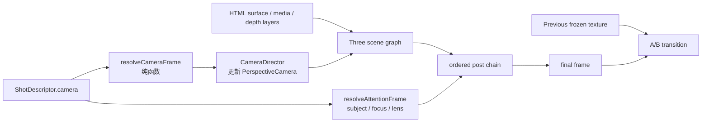

# Three 镜头表达系统设计

<!--
[INPUT]: 依赖 Three-first `ShotGraph`、`HtmlSurface`、现有 `materials`、`CameraMotionBlur` 与镜头配方。
[OUTPUT]: 定义 camera 观看、surface 姿态/曲面、attention 拉焦/放大镜和 A/B flip 的统一镜头合同、运行时边界与实施顺序。
[POS]: `apps/remotion-studio` 的镜头系统演进设计；实现、catalog、Skill 与视觉验收均以本文件为准。
[PROTOCOL]: 变更时更新此头部，然后检查 README.md
-->

> 状态：Shot Language MVP 已实施（单平面真实 Three camera、`subject.anchor`、surface 的 position/rotation/scale/bend keyframes、三个场景样例，以及镜头层特效弹框中的六个可播放 preset）；多平面景深与有序 post chain 仍待实施。目标不是把 CSS transform 换成更多参数，而是让观看、物体姿态、焦点和光学效果描述同一个观看意图。

## 决策

在现有 Three-first 合成器上加入 **Shot Language**。`Camera Director` 消费每个 `ShotDescriptor.camera` 的观看轨，逐帧驱动真正的 Three `PerspectiveCamera`；`SurfaceMotion` 消费 `ShotDescriptor.surface`，逐帧驱动同一张 HtmlSurface mesh 的位置、倾斜、缩放和曲率。内容仍由 `HtmlSurface` 生成纹理，材质仍由 `materials` 消费纹理。镜头表达把空间拆为“谁在看”和“被拍物怎样入镜”，后处理只定义像素光学，A/B 转场只定义两张镜头纹理之间的关系。

```text
ShotDescriptor
  -> Camera Director     position + lookAt + fov + roll
  -> Surface Motion      position + rotation + scale + bend + shell
  -> Scene graph         HTML plane / BrowserShell / media plane / depth planes
  -> Post chain          focus blur -> magnify -> color/material pass
  -> A/B transition      flip / peel / cross-zoom only when two inputs exist
```

这消除三种目前会互相打架的实现：用 `PageCam` 的 CSS `scale` 冒充推镜、用静态 `ShotGraphProps.camera` 冒充运镜、让放大镜和焦点各自维护目标坐标。

## 边界与事实

| 层 | 职责 | 不负责 |
| --- | --- | --- |
| `Camera Director` | 相机位置、朝向、焦距、roll、稳定的确定性微抖。 | 模糊、色散、HUD、A/B 合成。 |
| Scene graph | 把 HTML、图片或显式 depth layer 放到世界坐标。 | 猜测视觉重点。 |
| Post chain | 拉焦的模糊、放大镜、玻璃等单输入像素效果。 | 让一个平面凭空拥有遮挡正确的景深。 |
| Transition | 同时消费前后镜头纹理的 `flip`、`peel`、`cross-zoom`。 | 被伪装为单镜头 effect。 |

**平面 HTML 的边界必须诚实。** 第一阶段 `HtmlSurfacePlane` 虽只有一个深度，但它可以在真实 PerspectiveCamera 前做 Z 位移、倾斜、缩放和实际网格弯曲；一张纸从斜后方快速落到镜头前，会有真实的 2.5D 透视。`surface.shell="browser"` 可把同一张页面装进有厚度的 Chrome 式外框；手机/设备模型是同一个 shell 边界的后续实现。它仍不能产生同一页面内部的真实遮挡景深。`focus` 在第一阶段是明确的屏幕空间 focus mask（复用并泛化 `text-focus` 的 blur），不是假装有深度贴图的 bokeh。第二阶段只有在内容声明为多平面后，才以 layer Z/depth buffer 做真正的景深。

## 单一镜头合同

`ShotDescriptor` 同时声明 `camera`（观看者）与 `surface`（被拍物），并逐步以有序 `post` 取代只能容纳一个 `effect` 的位置。根级 `ShotGraphProps.camera` 仅保留为默认静态机位；它不再承载逐镜头运动。

```ts
type Vec2 = readonly [number, number];
type Vec3 = readonly [number, number, number];
type CameraVerb = "locked" | "drift" | "push-in" | "pull-out" | "truck" | "crane" | "orbit" | "dolly-zoom";
type CameraEasing = "linear" | "ease-in" | "ease-out" | "ease-in-out" | "impact";

type Subject = {
  // 统一的设计坐标真相：左上为 [0, 0]，右下为 [1, 1]。
  anchor: Vec2;
  // 仅多平面镜头使用；零是 HTML 主平面。
  depth?: number;
};

type CameraKeyframe = {
  at: number; // 当前镜头进度 0..1，不使用绝对帧
  position?: Vec3;
  target?: Vec3;
  fov?: number;
  roll?: number;
  easing?: CameraEasing;
};

type FocusTrack = {
  mode: "none" | "rack" | "hold";
  subject: Subject;
  radius: number;       // 设计像素，焦区大小
  intensity: number;    // 0..1，首期屏幕空间模糊强度
  at: readonly [number, number];
};

type LensTrack = {
  subject: Subject;
  at: readonly [number, number];
  zoom: number;
  radius: number;
  hud?: number;
};

type CameraMove = {
  verb: CameraVerb;
  subject: Subject;
  keyframes: readonly CameraKeyframe[]; // 2--4 个，首尾必须覆盖 0 与 1
  focus?: FocusTrack;
  lens?: LensTrack;
  motionBlur?: { shutterAngle: number; samples: number; at: readonly [number, number] };
};

type SurfaceKeyframe = {
  at: number;
  position?: Vec3;
  rotation?: Vec3;
  scale?: Vec3;
  bend?: number; // 0 为平面；正值为实际网格曲率
  easing?: CameraEasing;
};

type SurfaceMove = {
  shell?: "plain" | "browser"; // phone / gltf-device 只扩展这个判别器
  keyframes: readonly SurfaceKeyframe[];
};

type PostEffect = {
  id: MaterialId;
  options?: Record<string, unknown>;
};

type NextShotDescriptor = Omit<ShotDescriptor, "effect" | "lens"> & {
  camera?: CameraMove;
  surface?: SurfaceMove;
  post?: readonly PostEffect[];
};
```

### 坐标、焦点与光学的同源规则

`Subject.anchor` 是用户和 Agent 唯一需要表达的目标：按钮、人物、数字或产品主体都以 composition 归一化坐标定位。`Camera Director` 将它投影到当前内容平面世界坐标；focus mask 与 magnifier 从同一 anchor 取得 UV。Y 轴翻转只允许在一个 `screenToMaterialUv()` 边界发生，不能散落在 camera、lens 和 shader 调用处。

所以“推进并看清导出按钮”只有一个 subject，而不是三个不一致的 `cx/cy`、`lookAt`、`center`。

```ts
camera: {
  verb: "push-in",
  subject: { anchor: [0.74, 0.31] },
  keyframes: [
    { at: 0, position: [0, 0, 8], target: [0, 0, 0], fov: 34 },
    { at: 1, position: [0.45, 0.28, 4.5], target: [0.62, 0.45, 0], fov: 29, easing: "ease-in-out" },
  ],
  focus: { mode: "rack", subject: { anchor: [0.74, 0.31] }, radius: 260, intensity: 0.72, at: [0.34, 0.82] },
  lens: { subject: { anchor: [0.74, 0.31] }, at: [0.62, 1], zoom: 1.8, radius: 150, hud: 0.7 },
}
```

## 推荐镜头系列

镜头不是一个动词列表，而是五个按顺序组合的表达层。每层只选择一个主手法，避免“所有参数都开”的廉价感。

| 层 | 解决的问题 | 当前可用表达 | 组合纪律 |
| --- | --- | --- | --- |
| `shell` | 内容是什么实体。 | `plain`、有厚度的 `browser`；后续 phone/GLTF device。 | 外壳与页面共享同一 surface 轨。 |
| `pose` | 它从哪里、以什么朝向进入。 | Z 落位、横/纵切入、yaw、pitch、roll、scale。 | 约 24--32f 落位，随后保持阅读。 |
| `geometry` | 平面是否有材料感。 | 全页 `bend`、单角 `cornerCurl`、低幅 `cloth`。 | 只选一个局部主角；cloth 不服务密集阅读。 |
| `view` | 观众如何观察。 | locked、drift、push-in、pull-out、truck、crane、orbit。 | camera 与 pose 不能同时做两次大动作。 |
| `attention` | 眼睛落到哪里。 | text-focus、magnify/lens、色彩/颗粒。 | 一段最多一个强光学主角。 |

下面十个 preset 已进镜头层弹框，并都有真实 Three 预览。它们是可以直接选用的组合，而不是强迫创作者逐项调参：

| preset | 组合 | 最适合的叙事时刻 |
| --- | --- | --- |
| `Camera Drift` | 微倾落位 → 小幅 drift。 | 给静态信息一点空间呼吸。 |
| `Push In` | 斜后方 bend 落位 → 快速 dolly。 | 把总览收束为一个主张。 |
| `Pull Out` | 平面后撤并轻弯。 | 细节讲完，交代全貌。 |
| `Camera Truck` | 横侧进入 → 快速横移归正。 | 对比、左右扫描。 |
| `Camera Crane` | 俯倾落位 → crane。 | 数据或大物体的落点。 |
| `Lens Inspect` | browser shell → bend 落位 → push → magnify。 | UI 按钮、参数、证据细节。 |
| `Corner Curl Land` | 右上单角卷起 → yaw/roll 归正。 | 揭开一张卡、章节关键句。 |
| `Dutch Settle` | 大 roll/yaw 入场 → 正面归位。 | 警报、反转、明确立场。 |
| `Browser Rise` | 有厚度 browser shell 从俯视角升起。 | SaaS 功能、网页成果、操作步骤。 |
| `Cloth Breathe` | 轻 cloth + bend + 微 drift。 | 海报、品牌与情绪段；禁用于密集正文。 |

`displacement` 属于 surface 层，能与 `bend` / `cornerCurl` / `cloth` 以及 pose 叠加；它只在信息落位前后的短窗口扰动纹理。`text-focus` / `magnify` 属于 attention 层，紧随 surface 后执行。`glass`、`bubble`、`magnify` 都是强光学主角，彼此互斥。

`flip` 不属于上表。它是 `transition: { material: "flip" }`：必须有前镜头 A 与当前镜头 B 两张纹理；相机可以在转场两端各自落位，不能在一个单输入页面上用 UV 压缩冒充“镜头翻转”。现有 `FlipTransitionMaterial` 是视觉近似，第二阶段可升级为真正的网格翻面，但其 A/B 边界不变。

## 运行时结构



### 组件职责

| 位置 | 新职责 | 保持不变 |
| --- | --- | --- |
| `three/types.ts` | `CameraMove`、`Subject`、`FocusTrack` 与纯粹的 keyframe 校验。 | `shotAt()` 仍是镜头时间真相。 |
| `three/CameraDirector.tsx` | `resolveCameraFrame()`、坐标投影、`CameraDirector`。所有值只由 `shot.progress` 派生。 | 不读取 DOM，不持久化上一帧。 |
| `three/ShotGraph.tsx` | 在真实 camera 下挂内容/深度层，并将有序 post 链交给合成器。 | content 仍在 `Sequence` 的真实 React 树中。 |
| `three/HtmlSurface.tsx` | 保持单一内容捕获来源。 | 不因每个镜头或 post 再建 capture canvas。 |
| `materials/` | 将 `text-focus` 泛化为 `focus-blur`，magnify 接收统一转换后的中心。 | 每种材质仍只消费 texture + uniform。 |
| `materials/MaterialElement.tsx` | 被 pass composer 取代为有序单输入链。 | A/B transition 仍不进入单输入链。 |

`CameraDirector` 使用 `useFrame` 提交已由当前帧算出的 position、quaternion、fov 和 roll；它不得进行积分、阻尼 state 或随机采样。`RemotionFrameInvalidator` 仍然保证 demand frame loop 在 seek/导出时重绘。

## 多层与真实景深的阶段边界

### 输出层先于深度层

世界坐标不是默认的文字容器。每个场景可选择两条独立、可组合的输出路径：

```text
world beat -> HtmlSurface -> Three scene -> camera / shader -> final frame
screen beat -> DOM overlay -------------------------------> final frame
captions    -> DOM overlay (highest z-index) -------------> final frame
```

`Scene.screenKind` 是明确的屏幕层 renderer key。模板把它交给 `SceneScreenLayer`，后者与 world 使用同一份 beat 时序，
但在 `ShotGraph` 之后才绘制。未声明 `screenKind` 的 beat 不会产生屏幕层，也不会被引擎猜测或拆分。

- **world**：图片、视频、产品 UI、图形、数据卡与确实属于场景实体的文字；可以吃 PerspectiveCamera、放大镜与 shader。
- **screen**：标题、说明、HUD、品牌角标等需要稳定阅读的元素；不吃相机、景深、放大镜或后处理。
- **captions**：始终位于两者之上；字幕不是场景文字的自动替身。

这是一条输出空间边界，不是伪造 3D 的替代方案。内容何时进入 world、何时留在 screen 是场景/模板的导演决定；`SceneScreenLayer` 只忠实执行该声明。

第一阶段不修改内容的默认生产方式。`HtmlSurfacePlane` 是 z=0 的主表面，`MediaPlane` 已经可以显式传入 position/rotation/scale；这足以完成轻量推近、拉远、平移、倾斜和 lens inspect。

第二阶段新增受控的 `DepthLayer` 声明，而不是按 DOM selector 猜层：

```ts
type DepthLayer = {
  id: string;
  depth: number;
  content: "html" | "media";
  transform?: { position?: Vec3; rotation?: Vec3; scale?: Vec3 };
};
```

只有场景明确提供前/中/后层，`truck`、`orbit`、真实 rack focus 才承诺视差、遮挡和 depth-of-field。层数首期封顶三层；每层有独立高分辨率纹理，禁止把同一整页纹理切三份后宣称有空间。

## 放大镜与焦外的组合顺序

一条镜头最多有一个强光学主角。默认顺序如下：

```text
scene geometry -> focus blur -> magnify/glass -> color/grain
```

- `focus blur` 先收束注意力，再让 lens 放大仍清晰的 subject；lens 之外保留焦外。
- `magnify` 与 `glass` 互斥；`bubble`、全屏 `glitch`、重型 page transition 与 focus/lens 也互斥。
- `motionBlur` 只覆盖镜头峰值速度区间；停稳后的对焦、HUD 与可读文字不采样模糊。
- focus 与 lens 的生命周期由同一个 `Subject` 和 `at` 窗口驱动，窗口未交叠时强制拒绝配置。

## Skill 表达语言

`skills/remotion-studio/references/shot-recipes/camera/README.md` 是 Agent 的镜头语言入口。一个镜头先写一句语义句，再落 `CameraMove`：

```text
意图 -> 基底 -> 动词 -> 主体 -> 焦点/光学 -> 节奏 -> 不可叠加项
"从全局缓推到导出按钮；单平面；push-in；右上按钮；拉焦后放大；52f；不叠 crash zoom。"
```

这比直接写 `scale(1.4)` 或 `rotateY(-12deg)` 更重要。前者表达镜头为何存在，后者只是某个 renderer 的实现细节。旧配方不是废弃：`crash-zoom-punch`、`depth-layer-moves`、`space-camera-moves` 等均在新入口有明确映射；在 Camera Director 落地之前，它们仍用当前 `PageCam`/`Rig`/材质实现，不能在项目代码中伪造未发布 API。

## 实施顺序

1. **纯合同与解析器**：已完成基础合同与无状态 `resolveCameraFrame`；后续补参数校验和单元测试。
2. **轻量真实 camera**：已完成 `CameraDirector` 与 `ShotGraph` 单平面接入；`drift`、`push-in`、`crane` 已在三个场景样例使用，剩余动词按实际 fixture 扩展。
3. **注意力链**：引入 ordered post chain，泛化 `text-focus`，把 magnify/lens 接到统一 subject。交付 `focus-pull`、`lens-inspect`。
4. **转场校正**：保留 flip A/B 合同，补性能与视觉基准；不把它混入 camera preset。
5. **多平面**：仅为需要它的场景增加 `DepthLayer`；再交付 `orbit`、真实 rack focus 与 `dolly-zoom`。
6. **产品入口**：已接入 catalog 的六个 `three-camera` preset、真实 `CameraPreview` fixture 和 EffectsFineTune 的 `descriptor.camera` Prompt；未来新增 preset 仍必须同时提供 preview fixture、放置语义和参数约束。

## 验收

| 类别 | 必过条件 |
| --- | --- |
| 确定性 | 相同输入连续导出两次逐帧一致；任意 seek 直接到相同 camera/focus/lens 状态。 |
| 构图 | `subject.anchor` 在镜头终点落在预期安全区；没有散落的 Y 轴翻转或第二套目标坐标。 |
| 真实性 | 单平面镜头不宣传真实层次景深；`orbit`/真实 rack focus 只在 `DepthLayer` 场景启用。 |
| 可读性 | 高速段结束后文字至少 hold 15f；motion blur 不覆盖阅读落点。 |
| 性能 | 1080p/30fps 记录 `drift`、`lens-inspect`、focus+lens、flip 的 GPU 时间与 texture 峰值；活动 heavy post 不超过一个。 |
| 回归 | 每个 preset 有真实素材 fixture 的开始、中段、落位三张快照；Flip 同时验证 A/B 输入而非单图变形。 |

## 品味自检

- 一段镜头只有一个持镜人：不能同时 `push-in`、orbit、crash zoom 和页面自身大位移。
- 目标不是坐标垃圾场：camera、focus、lens 必须共享一个 `Subject`。
- 真实 3D 来自相机与层关系，不来自给整页加 `rotateY` 的命名幻觉。
- 先让少数镜头稳定、可读、可导出，再开放自由曲线与复杂物理。

[PROTOCOL]: 变更时更新此头部，然后检查 README.md
